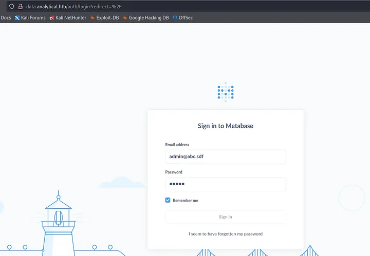
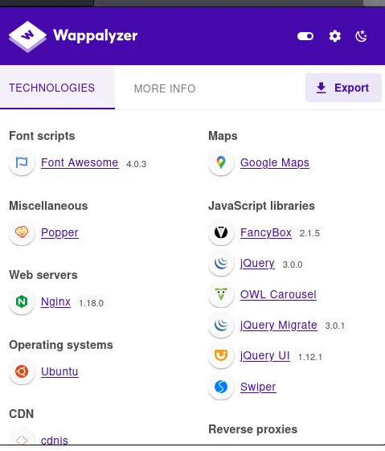
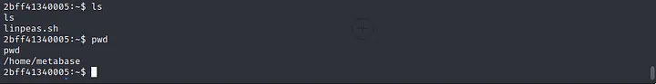
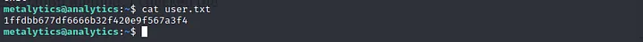

# Analytics | HTB Walkthrough

**Machine IP:** 10.10.11.233

## Initial Nmap Scan
Initally, we did nmap scan at 10.10.11.233

```bash
└─$ nmap -p- 10.10.11.233 -T4
Starting Nmap 7.94 ( https://nmap.org ) at 2023-11-01 06:15 +0545
Stats: 0:02:00 elapsed; 0 hosts completed (1 up), 1 undergoing Connect Scan
Connect Scan Timing: About 9.94% done; ETC: 06:35 (0:18:16 remaining)
Stats: 0:02:49 elapsed; 0 hosts completed (1 up), 1 undergoing Connect Scan
Connect Scan Timing: About 12.50% done; ETC: 06:38 (0:19:50 remaining)
Warning: 10.10.11.233 giving up on port because retransmission cap hit (6).
Stats: 0:14:40 elapsed; 0 hosts completed (1 up), 1 undergoing Connect Scan
Connect Scan Timing: About 57.04% done; ETC: 06:41 (0:11:03 remaining)
Stats: 0:20:16 elapsed; 0 hosts completed (1 up), 1 undergoing Connect Scan
Connect Scan Timing: About 87.93% done; ETC: 06:38 (0:02:47 remaining)
Nmap scan report for 10.10.11.233
Host is up (0.31s latency).
Not shown: 65323 closed tcp ports (conn-refused), 210 filtered tcp ports (no-response)
PORT   STATE SERVICE
22/tcp open  ssh
80/tcp open  http
Nmap done: 1 IP address (1 host up) scanned in 1404.10 seconds
```

This shows that port 22 and 80 are open, so we ran the default Nmap script over these ports.
```
└─$ sudo nmap -sCV -p 22,80 10.10.11.233 -T4
[sudo] password for patali:
Starting Nmap 7.94 ( https://nmap.org ) at 2023-11-01 06:40 +0545
Nmap scan report for 10.10.11.233
Host is up (0.30s latency).
PORT   STATE SERVICE VERSION
22/tcp open  ssh     OpenSSH 8.9p1 Ubuntu 3ubuntu0.4 (Ubuntu Linux; protocol 2.0)
| ssh-hostkey: 
|   256 3e:ea:45:4b:c5:d1:6d:6f:e2:d4:d1:3b:0a:3d:a9:4f (ECDSA)
|_  256 64:cc:75:de:4a:e6:a5:b4:73:eb:3f:1b:cf:b4:e3:94 (ED25519)
80/tcp open  http    nginx 1.18.0 (Ubuntu)
|_http-title: Did not follow redirect to http://analytical.htb/
|_http-server-header: nginx/1.18.0 (Ubuntu)
Service Info: OS: Linux; CPE: cpe:/o:linux:linux_kernel

Service detection performed. Please report any incorrect results at https://nmap.org/submit/.
Nmap done: 1 IP address (1 host up) scanned in 16.91 seconds
```
From here, we get that we need to point our machine IP to analytical.htb in our /etc/hosts file.

## Recon
On surfing through analytical.htb, we get a button login which was pointing to http://data.analytical.htb/, so we added it in our host file.
<figure style="display: block; text-align: center;">
  
  <figcaption>Figure 1: Login page of data analytical.htb </figcaption>
</figure>


### Fuzzing
Visiting http://data.analytical.htb/, it was basically a login page. So, I tried to bypass it with SQLi but ended up with nothing. I ran dirsearch with the hope that I could bypass it with force browsing, but again, we got nothing. So, I decided to come back to analytical.htb and ran dirsearch; still, there was nothing.

### Wappalyzer
Then I started to check if any component was vulnerable to any CVE but relying on Wappalyzer, none of them seemed exploitable.

<figure style="display: block; text-align: center;">
  
  <figcaption>Figure 2: Wappalyzer Inspection </figcaption>
</figure>


### Google Search
Since it was using metabase component, I decided to check if there was any vulnerablilty that could give me any lead.

On doing normal google search metabase vulnearabilites, we got lead like https://www.acunetix.com/vulnerabilities/web/metabase-rce-cve-2023-38646/, on searching for exploit we reached to https://github.com/kh4sh3i/CVE-2023-38646/tree/main

But it was asking for a token, so going through exploit script, we can fetch token from http://data.analytical.htb/api/session/properties . This script didnot work as expected and on going through the script it was just test script. 


## Running Exploit
I checked for another script, and got to https://github.com/Red4mber/CVE-2023-38646 .

On running this scipt we got reverse shell.
<figure style="display: block; text-align: center;">
  
  <figcaption>Figure 3: Running Exploit </figcaption>
</figure>


### Reverse Shell connection
<figure style="display: block; text-align: center;">
  
  <figcaption>Figure 4: Reverse Shell Connection </figcaption>
</figure>


## Gathering Information
While looking into directories there was linpeas.sh in home directory of metabase.

<figure style="display: block; text-align: center;">
  
  <figcaption>Figure 5: Linpeas.sh </figcaption>
</figure>
After trying suid bit files, capabilities of current user, or any file that has wrong permission, at last we checked environment variables.

<figure style="display: block; text-align: center;">
  
  <figcaption>Figure 6: Environment variable </figcaption>
</figure>
We got credentials. After trying that creds for root and we got no success.


## SSH Connection
 We get back to port 22 and tried to do ssh then we successfully got ssh on the machine as metalytics.
 <figure style="display: block; text-align: center;">
  
  <figcaption>Figure 7: Environment variable </figcaption>
</figure>


## Reading User flag
Then there was user.txt which contan the user flag ```1ffdbb677df6666b32f420e9f567a3f4```

 <figure style="display: block; text-align: center;">
  
  <figcaption>Figure 8: Reading User Flag </figcaption>
</figure>

## Previlege Escalate
After trying different method of privilege escalation method, I checked the system version and it was Ubuntu 22.04.2.
 <figure style="display: block; text-align: center;">
  
  <figcaption>Figure 9: System Version Details </figcaption>
</figure>


So, I searched for previlege escalation for this system and tried PE cves exploiting scripts like https://github.com/MaherAzzouzi/CVE-2022-37706-LPE-exploit .

Then tried https://github.com/g1vi/CVE-2023-2640-CVE-2023-32629 which successfully gave me root access.

 <figure style="display: block; text-align: center;">
  
  <figcaption>Figure 10: Downloading and running exploit and got root </figcaption>
</figure>


This way, we successfully made way to root flag ```30fbdcaa5d1206fe79ca064c9fc5d7dd```