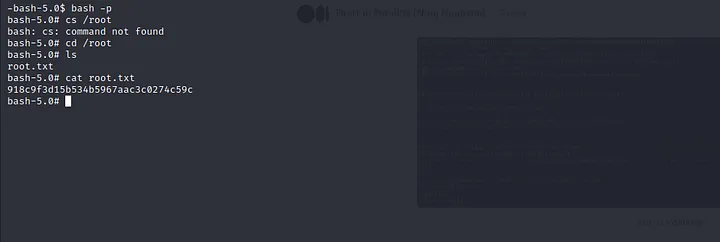

# Topology | HTB Walkthrough

**Machine IP:** 10.10.11.217

## Initial Nmap Scan

Initially, we did an nmap scan on 10.10.11.217.

```bash
└─$ nmap -p- 10.10.11.217 -T4
Starting Nmap 7.94 ( https://nmap.org ) at 2023-11-01 18:50 +0545
Stats: 0:23:52 elapsed; 0 hosts completed (1 up), 1 undergoing Connect Scan
Connect Scan Timing: About 68.81% done; ETC: 19:24 (0:10:49 remaining)
Nmap scan report for 10.10.11.217
Host is up (0.28s latency).
Not shown: 65384 closed tcp ports (conn-refused), 149 filtered tcp ports (no-response)
PORT   STATE SERVICE
22/tcp open  ssh
80/tcp open  http

Nmap done: 1 IP address (1 host up) scanned in 1848.18 seconds
```

Here, I found port 22 and 80 open. So, I did another nmap scan on these ports.

```bash
└─$ sudo nmap -sCV -p 22,80 10.10.11.217 -T4
[sudo] password for patali: 
Starting Nmap 7.94 ( https://nmap.org ) at 2023-11-01 19:35 +0545
Nmap scan report for 10.10.11.217
Host is up (0.28s latency).

PORT   STATE SERVICE VERSION
22/tcp open  ssh     OpenSSH 8.2p1 Ubuntu 4ubuntu0.7 (Ubuntu Linux; protocol 2.0)
| ssh-hostkey: 
|   3072 dc:bc:32:86:e8:e8:45:78:10:bc:2b:5d:bf:0f:55:c6 (RSA)
|   256 d9:f3:39:69:2c:6c:27:f1:a9:2d:50:6c:a7:9f:1c:33 (ECDSA)
|_  256 4c:a6:50:75:d0:93:4f:9c:4a:1b:89:0a:7a:27:08:d7 (ED25519)
80/tcp open  http    Apache httpd 2.4.41 ((Ubuntu))
|_http-server-header: Apache/2.4.41 (Ubuntu)
|_http-title: Miskatonic University | Topology Group
Service Info: OS: Linux; CPE: cpe:/o:linux:linux_kernel

Service detection performed. Please report any incorrect results at https://nmap.org/submit/ .
Nmap done: 1 IP address (1 host up) scanned in 32.35 seconds
```

I added `10.10.11.217` as `topology.htb` at `/etc/hosts` file. Then, we did dirsearch but got nothing.

## Exploring LaTeX Functionality

On visiting `topology.htb`, there was a functionality that allows typing LaTeX equations and getting the answer as an image at `latex.topology.htb/equation.php`.
<figure>
  
  <figcaption>Figure 1: Homepage</figcaption>
</figure>

I tried basic LaTeX syntax and searched for LaTeX injection. An article from HackTricks (https://book.hacktricks.xyz/pentesting-web/formula-csv-doc-latex-ghostscript-injection) helped a lot. Tried a few payloads from it but they were not working:
```
\input{/etc/passwd}
\include{password}
```

But when we used the payload `\lstinputlisting{/etc/passwd}` after wrapping it with dollar signs, and preparing the final payload as:
```
$\lstinputlisting{/etc/passwd}$
```
<figure style="display: block;">
  
  <figcaption>Figure 2: Reading /etc/passwd file by exploiting LaTeX injection </figcaption>
</figure>


From this, we got user `vdaisley` and root with an interactive shell. I tried to read different configuration files like:
- `/etc/nginx/nginx.conf`
- `/var/log/nginx/error.log` (it might contain the app path)
- `/var/log/apache2/access.log`
- `/var/www/html/.htaccess`
- `/home/vdaisley/.bashrc`
- `/home/vdaisley/.bashrc_history`

## Fuzzing Virtual Host
We got no output. So, I decided to go back and tried to find what I was missing. Then I did dirsearch over `latex.topology.htb/equation.php` and vhost fuzzing over `*.topology.htb`.

<figure style="display: block;">
  
  <figcaption>Figure 3: Fuzzing virtual host </figcaption>
</figure>


### Content of `.htpasswd` File
We added `dev.topology.htb` in our hosts file, but when we tried to access it, it was asking for basic authentication. I tried to find if there is any unauthenticated endpoint with dirsearch but couldn't find any.

Then I was kind of stuck, but as I checked from the start what I had done, I was able to join the dots of basic authentication with local file inclusion. To be clear, I tried to read the `/var/www/dev/.htpasswd` file with the payload:
```
$\lstinputlisting{/var/www/dev/.htpasswd}$
```
<figure style="display: block;">
  
  <figcaption>Figure 4: Content of .htpasswd file </figcaption>
</figure>


We got username `vdaisley` and password hash `$apr1$1ONUB/S2$58eeNVirnRDB5zAIbIxTY0`.

<figure style="display: block;">
  
  <figcaption style="">Figure 5: Using hash-identifier to identify the hash </figcaption>
</figure>
Using hash-identifier to identify the hash, we cracked it with hashcat with the help of the `rockyou.txt` wordlist.


We got the password `calculus20`.

**Username:** vdaisley  
**Password:** calculus20

Then we finally logged into `dev.topology.htb`.

<figure style="display: block;">
  
  <figcaption>Figure 6: Homepage of dev.topology.htb  </figcaption>
</figure>


## SSH as `vdaisley` And Reading First Flag
Again we got a static page and it seemed like a dead end. But as I was looking again from the start, there was port 22 open, so I tried to SSH into the machine with these credentials.

<figure style="display: block;">
  
  <figcaption>Figure 7: SSH into server  </figcaption>
</figure>

In the same directory, there was `user.txt` which contained our first flag. The flag was `e35a06e09244b1b0e44e17c110ca32a7`.
<figure style="display: block;">
  
  <figcaption>Figure 8: Reading user flag  </figcaption>
</figure>

## Reading Root Flag

Along with `user.txt`, there were some other files: `pspy64s` and `pspy32s`. After googling, I figured out that pspy is a tool to monitor Linux processes without root. So, I tried to execute `pspy64s` but it threw an error, so I tried to execute `pspy32s`.

On executing, we got to know there is `gnuplot` executing on the system.

After a little bit of research, we found a way to exploit it. So, we created a file called `random.plt` inside `/opt/gnuplot/`.

As the bash shell has the suid bit set, we got root shell with `bash -p` and I found another flag at `/root/root.txt` as `918c9f3d15b534b5967aac3c0274c59c`.

<figure style="display: block;">
  
  <figcaption>Figure 9: Getting root shell and reading root flag  </figcaption>
</figure>


<figure style="display: block;">
  
  <figcaption>Figure 10: PWNED  </figcaption>
</figure>